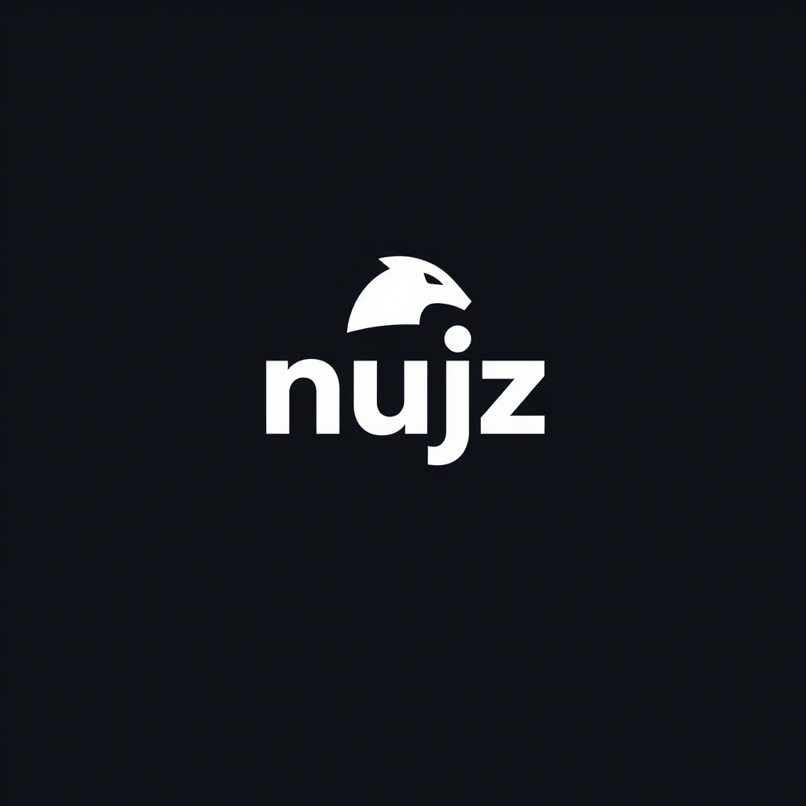

# 👨‍💻 محمد خالد (Mohamed Khaled)

> "أسعى لصناعة أدوات تبرمج العالم وتخدم الإنسان."

---

## 🚀 نبذة عني

مطور ويب، ومصمم ومبرمج لغات برمجة جديدة، ومهتم بأنظمة التشغيل. أعمل باستخدام الهاتف عبر أدوات قوية مثل Termux. أركز على تقديم حلول وأدوات تفتح آفاقًا جديدة للمبرمجين، بلغة وأسلوب حديث.

---

## 🛠️ المهارات الأساسية

- 💻 Web Development
- 🧠 Programming Language Development
- 🧩 Operating System Development

---

## 🧰 الأدوات التي أستخدمها

| التكنولوجيات |     |     |
|---------------|-----|-----|
|  |  |  |
|  |  |  |
|  |  |  |

---

## 📌 المشاريع المميزة

| المشروع | الوصف |
|---------|--------|
| 🧪 nujz | لغة برمجة جديدة من تصميمي، بهدف تسهيل البرمجة بأسلوب مختلف وخاص |
| 🌐 موقع nujz | موقع إلكتروني خاص باللغة، لعرض الوثائق والتعليم |
| 📝 محرر nujz | محرر أكواد مخصص يدعم لغة nujz مع أدوات متقدمة |

---

## 🎯 رؤيتي

> لا أبرمج لمجرد كتابة كود، بل لأصنع أدوات تخدم الناس، وتغير شكل العالم خطوة بخطوة.

---

## 📫 تواصل معي

- 📧 mohammed.khaled.abdullah.mauhod@gmail.com
- 🌐 [GitHub](https://github.com/WithoutGuidanc)
- 📘 [Facebook](https://www.facebook.com/share/1AG2Por8g8/)
- 💼 [LinkedIn](https://linkedin.com/in/placeholder)

---

*تم التصميم بالكامل باستخدام ❤️ و📱 من الهاتف فقط.*
